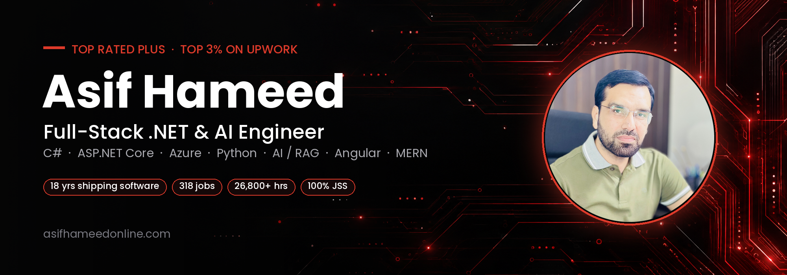
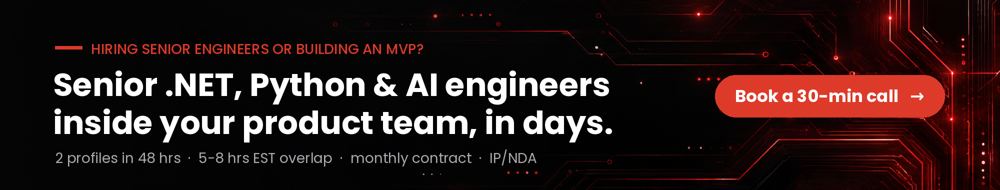

  
  
  
  
  

### I build production .NET, Azure and AI systems, and put senior engineers inside US product teams.

I started as a .NET engineer 18 years ago and never stopped writing code. Today I lead a senior engineering team that works as an extension of founders' and CTOs' own teams: C#, ASP.NET Core, Azure, Python, AI agents, Angular and the MERN stack.

On Upwork I'm **Top Rated Plus (top 3%)**: **318 jobs**, **26,800+ hours**, **$800K+ earned** and a **100% Job Success Score**.

**What I usually get hired for**

- **Senior engineers for your team.** .NET, Python, AI and full-stack developers who join your standups, work your sprint and ship in your repo. First profiles in 48 hours.
- **AI inside your .NET product, not bolted on.** Semantic Kernel, Azure OpenAI, RAG with Azure AI Search or pgvector, Azure Document Intelligence, ML.NET. Ticket routing, document extraction, dashboards that summarize instead of just display, voice and chat agents.
- **MVPs and SaaS.** From scope to a product users can log into. ASP.NET Core or Node APIs, Angular or React front ends, SQL Server / PostgreSQL / MongoDB, deployed on Azure or AWS.
- **.NET modernization.** .NET Framework to .NET 8/10, made AI-capable in the same pass, Web Forms / MVC to ASP.NET Core + Angular, Xamarin to .NET MAUI, slow SQL made fast.

---

## Tech stack

<table>
  <tr>
    <td><b>.NET / C#</b></td>
    <td>
      
      
      
      
      
      
      
      
    </td>
  </tr>
  <tr>
    <td><b>Cloud</b></td>
    <td>
      
      
      
      
      
      
      
      
    </td>
  </tr>
  <tr>
    <td><b>AI / Python</b></td>
    <td>
      
      
      
      
      
      
      
      
      
      
    </td>
  </tr>
  <tr>
    <td><b>Front end</b></td>
    <td>
      
      
      
      
      
      
    </td>
  </tr>
  <tr>
    <td><b>MERN</b></td>
    <td>
      
      
      
      
    </td>
  </tr>
  <tr>
    <td><b>Data</b></td>
    <td>
      
      
      
      
    </td>
  </tr>
</table>

---

## Recent AI work, measured

Most client code sits in private repos under NDA. These are the results I can share.

| Project | Stack | What changed for the client |
|---|---|---|
| **CasePath**, AI case management SaaS for child-welfare agencies | LLM · document AI | **90%** less documentation time, **83%** faster decisions, **+20%** caseload per worker |
| **AI Recruitment Engine**: LLM resume scoring, sourcing, outreach | AI agents · automation | Shortlist in **6 hours instead of 5 days**, **800+** candidates screened a week, **0** new recruiters hired |
| **Bagallery AI chat** (eCommerce) | AI chat · eCommerce | **+50%** conversions, **35%** faster responses, **40%** less support load |
| **Talk-Lee**, AI voice agent platform | Python · LLM · NLU | LLM voice agents with natural-language understanding (case study on Upwork) |

---

## Public repos worth a look

| Repo | What it shows |
|---|---|
| [**XF-to-MAUI-Migration-Sample**](https://github.com/asifhameed8/XF-to-MAUI-Migration-Sample) | Xamarin.Forms to .NET MAUI migration: MVVM, DI, Shell navigation |
| [**Texell-RateDisplay-Demo**](https://github.com/asifhameed8/Texell-RateDisplay-Demo) | Real-time loan rate board, ASP.NET Core API + Angular |
| [**Autoplicity-AuctionEcommerce-CaseStudy**](https://github.com/asifhameed8/Autoplicity-AuctionEcommerce-CaseStudy) | Automotive eCommerce on NopCommerce + ASP.NET Core, 500K+ SKUs, YMM search |
| [**Chat-Service**](https://github.com/asifhameed8/Chat-Service) | Real-time chat with ASP.NET Core, SignalR and Redis |
| [**InMemoryCacheService**](https://github.com/asifhameed8/InMemoryCacheService) | Thread-safe C# cache with TTL and async support |
| [**azurestorage-dotnetcore9**](https://github.com/asifhameed8/azurestorage-dotnetcore9) | File upload/download with Azure Blob Storage on .NET 9 |

---

## What clients say (Upwork)

> "Asif is a solid .NET developer. He delivered clean, reliable code with a great attitude and clear communication. I'd definitely work with him again." 
> — **Paul Mendoza**, SIG Parser

> "Asif joined an ongoing project with tight timelines. He learned the codebase fast, delivered tasks on time, and was always responsive and professional." 
> — **Eric Hamer**, Hamer Software LLC

> "Working with Asif on a complex Angular project exceeded expectations. He was technically strong, met deadlines, and ensured steady progress." 
> — **Stavros Kouris**, Algoria

> "Asif is a great developer and eager to understand the business context. His communication was consistent and clear. We're planning to hire him again for future projects." 
> — **Drisan James**, Ignite Media

[Read all 300+ job reviews on Upwork →](https://www.upwork.com/freelancers/~012c0e6dc418a59a9d)

---

## How working with my team goes

1. **30-minute scope call** with me, not a sales rep.
2. **2 engineer profiles in 48 hours**, matched to your stack.
3. **In your standup within 7 days**, with 5-8 hours of overlap with US Eastern time.
4. **Monthly contract**, IP and NDA signed upfront, free replacement within 5 days if the fit isn't right.

  <a href="https://asifhameedonline.com">asifhameedonline.com</a> ·
  <a href="https://www.linkedin.com/in/asifhameedpk">LinkedIn</a> ·
  <a href="https://www.upwork.com/freelancers/~012c0e6dc418a59a9d">Upwork</a> ·
  <a href="mailto:asif_hameed_37@hotmail.com">asif_hameed_37@hotmail.com</a>

